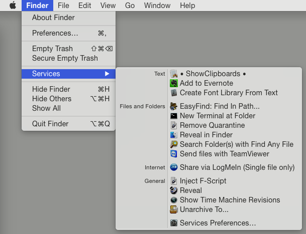
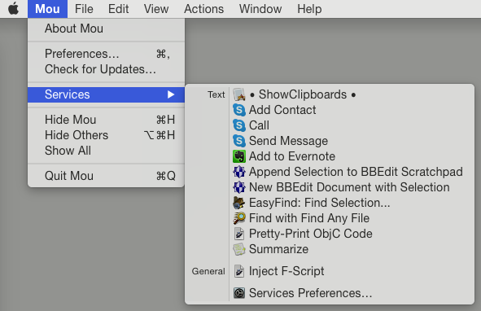
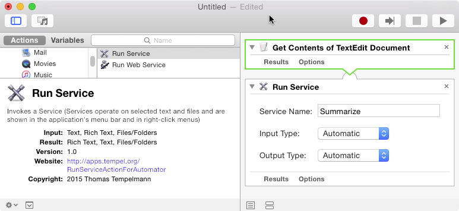

# RunServiceActionForAutomator
**An Automator Action plugin for invoking OS X Services.**

Most Services operate on either texts or files & folders (they can also work with web archives, but this isn't currently handled here).

Any of those services can now be used in Automator actions with the "Run Service" action provided by this project's free Automator plugin. This is handy in cases where such an operation is not provided as an distinct Automator action.

## Installation

To install the "Run Service" action, simply double click the **Run Service.action** file. That will prompt you to install it into *~/Library/Automator* if it's not already there.

To get the file, use the **Download ZIP** button on the right side of this page. The zip contains both the source code (which you probably don't need) and the action file.

Enjoy!

Thomas Tempelmann

[http://apps.tempel.org/](http://apps.tempel.org/)

## Examples

### Example of Services operating on files & folders:

### Example of Services operating on text:

### Example of using the "Run Service" action in Automator in order to invoke the "Summarize" Service.

